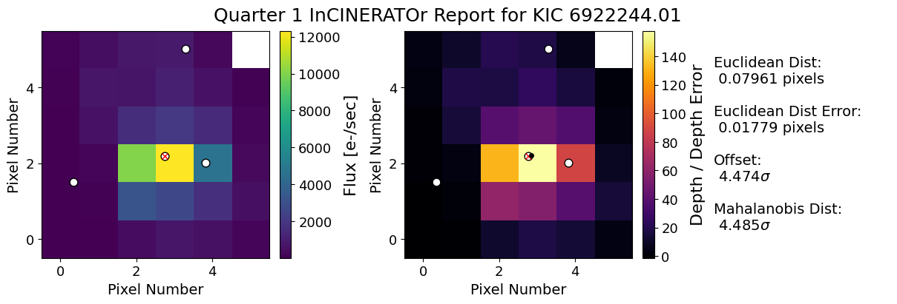

# Running INCInERATOr on a Kepler Target


In this tutorial, we will learn how to use `incinerator`!


## Step 1: Imports

First, make sure you are running the notebook in the **correct environment** (if you created one). Your Python kernel should be set to that environment.

Next, import `incinerator` and a few other useful packages.


```python
import numpy as np
import pandas as pd
from astropy.io import fits

import incinerator.localize as loc

%matplotlib inline
```

## Step 2: Initialize Localize Object

##### **NOTE:** `incinerator` can now handle observations from multiple epochs using the `Multi_Localize` class. An udated tutorial notebook showing this feature is coming soon!

### **Get Your File**

For this tutorial, we will use the Quarter 1 target pixel file (TPF) for **Kepler-8 (KIC 6922244)**.  

> ⚠️ Important: `incinerator` requires a **local file** when using **Kepler or TESS TPFs**, because it relies on information in the `.fits` header.

You have two options:

**1. Download manually**  

You can download the TPF from [MAST Kepler Search](https://archive.stsci.edu/kepler/data_search/search.php).

**2. Download using `astroquery`**

You will need to add the following to your imports:

```python
from astroquery.mast import Observations


```
#you can find the file in the tutorials/` folder inside the `docs/` directory on GitHub.
file_path = "kplr006922244-2009166043257_lpd-targ.fits"
#opening the file
hdu = fits.open(file_path)

#extracting time, flux cube (in this case a tpf), and flux cube error
time = hdu[1].data['TIME']
flux = hdu[1].data['FLUX']
flux_err = hdu[1].data['FLUX_ERR']
```

### **Load Your TCEs**

You will also need the information for the **Threshold Crossing Events (TCEs)**.  

You have two options:

**1. Read from a CSV file**

**2. Create a pandas DataFrame manually**

**Note:** Kepler-8 only has **one TCE**, but if your target has **multiple TCEs**, you can simply add each of them as a **row in the same DataFrame**.  

**Important:** Make sure the dataframe includes the columns:

- `period` → in **units of days**
- `t0` → in **BJD**
- `tdur` → best rounded to **two significant figures** and in **units of days**


```python
#creating tce dataframe
tces = pd.DataFrame({'star_id':6922244.01,
                     'period':3.5224,
                     't0':121.1194228+2454833,
                     'tdur':.12},index=[0])
```

### **Initialize the Localize Object**

Now it’s time to **create a `Localize` object**!  

You will need to provide the following inputs:

- `time` → 1D array of time values in BJD
- `flux` → 3D flux cube
- `flux_err` → 3D array of per-pixel uncertainties
- `tces` → TCE DataFrame containing period, t0, and tdur
- `id` → target's identifier (ie KIC or TIC)
- `ra_targ`, `dec_targ` → target coordinates in degrees
- `wcs` → WCS solution for pixel-to-sky transformations
- `epoch` → epoch of the input coordinates

> **Optional:** If you are analyzing a **background star in the TPF**, you can also include **bonus RA and DEC**. 

If these inputs are already available, you can initialize the object directly:
```python
loc_obj = loc.Localize(time=time, flux=flux, flux_err=flux_err, tces=tces, 
                    id='6922244', ra_targ=ra_targ, dec_targ=dec_targ, 
                    wcs=wcs, epoch=epoch, mission='kepler')
```

When starting from a Kepler or TESS TPF, the static method can load these inputs automatically:
```python
loc_obj = loc.Localize.from_tpf_info(file_path,tces,'6922244',mission='kepler')
```


```python
#initialize you Localize class object
loc_obj = loc.Localize.from_tpf_info(file_path,tces,'6922244',mission='kepler')
```

    /Users/jmoquin/mypy/incinerator/.venv/lib/python3.11/site-packages/erfa/core.py:133: ErfaWarning: ERFA function "pmsafe" yielded 4 of "distance overridden (Note 6)"
      warn(f'ERFA function "{func_name}" yielded {wmsg}', ErfaWarning)
    /Users/jmoquin/mypy/incinerator/.venv/lib/python3.11/site-packages/erfa/core.py:133: ErfaWarning: ERFA function "pmsafe" yielded 1 of "distance overridden (Note 6)"
      warn(f'ERFA function "{func_name}" yielded {wmsg}', ErfaWarning)


This is the recommended approach when working directly from a TPF. 

See the API documentation for the complete list of parameters.

## Step 3: Build the Design Matrix

Now we get to the easier part: running the necessary functions.

We need to **build the design matrix**, which incorporates all of the TCEs in your DataFrame.


```python
#build the design matrix
loc_obj.build_design_matrix()
```

`incinerator` now supports a `batman` transit model in addition to the box model. The transit model can be selected using the `transit_method` parameter. When using `batman`, you will need to provide precomputed model parameters (e.g., $R_p$, limb darkening coefficients, and inclination) for each TCE.

## Step 4: Generate Heatmaps and Fit PRF

### **Solve for the transits**

First, we solve for the **weights of each transit component** in the design matrix. 

If your target has multiple TCEs, they are **solved simultaneously**.


```python
#solve for the weights of the transit components
loc_obj.solve_transit_weights()
```

    /Users/jmoquin/mypy/incinerator/src/incinerator/localize.py:531: RuntimeWarning: invalid value encountered in sqrt
      self.weights_err[idx] = np.sqrt(np.diag(np.linalg.inv(sigma_w_inv)))


### **Fit PRF model**


Next, we fit the PRF model to the resulting heat map to determine the likely location of the signal on the CCD. 

If your target has **multiple TCEs**, you have two options:

**1. Fit all TCEs at once**
```python
  which_tce = None
```

**2. Fit one TCE at a time**
```python
  which_tce = <index of the TCE>
```


```python
#fit prf to heatmap
full_report, fit = loc_obj.fit_to_heatmap(method='prf',which_tce=0)
full_report
```


<h2>Fit Result</h2> <table class="jp-toc-ignore"><caption class="jp-toc-ignore">Fit Statistics</caption><tr><td style='text-align:left'>fitting method</td><td style='text-align:right'>leastsq</td></tr><tr><td style='text-align:left'># function evals</td><td style='text-align:right'>48</td></tr><tr><td style='text-align:left'># data points</td><td style='text-align:right'>35</td></tr><tr><td style='text-align:left'># variables</td><td style='text-align:right'>3</td></tr><tr><td style='text-align:left'>chi-square</td><td style='text-align:right'> 975.053016</td></tr><tr><td style='text-align:left'>reduced chi-square</td><td style='text-align:right'> 30.4704067</td></tr><tr><td style='text-align:left'>Akaike info crit.</td><td style='text-align:right'> 122.450032</td></tr><tr><td style='text-align:left'>Bayesian info crit.</td><td style='text-align:right'> 127.116077</td></tr></table><table class="jp-toc-ignore"><caption>Parameters</caption><tr><th style='text-align:left'>name</th><th style='text-align:left'>value</th><th style='text-align:left'>standard error</th><th style='text-align:left'>relative error</th><th style='text-align:left'>initial value</th><th style='text-align:left'>min</th><th style='text-align:left'>max</th><th style='text-align:right'>vary</th></tr><tr><td style='text-align:left'>centery</td><td style='text-align:left'> 2.20424801</td><td style='text-align:left'> 0.02157443</td><td style='text-align:left'>(0.98%)</td><td style='text-align:left'>2.1904447560534286</td><td style='text-align:left'> 0.00000000</td><td style='text-align:left'> 5.00000000</td><td style='text-align:right'>True</td></tr><tr><td style='text-align:left'>centerx</td><td style='text-align:left'> 2.83480228</td><td style='text-align:left'> 0.01766358</td><td style='text-align:left'>(0.62%)</td><td style='text-align:left'>2.7563988033219746</td><td style='text-align:left'> 0.00000000</td><td style='text-align:left'> 5.00000000</td><td style='text-align:right'>True</td></tr><tr><td style='text-align:left'>amplitude</td><td style='text-align:left'> 384.896472</td><td style='text-align:left'> 8.29757202</td><td style='text-align:left'>(2.16%)</td><td style='text-align:left'>98.6776473117501</td><td style='text-align:left'> 0.00000000</td><td style='text-align:left'>        inf</td><td style='text-align:right'>True</td></tr></table>


## Step 5: Visualize Results

### **Plot the results**


```python
#getting the incinerator report
loc_obj.plot_heatmap(fit,0,savefig=False)
```

    /Users/jmoquin/mypy/incinerator/src/incinerator/localize.py:901: RuntimeWarning: Mean of empty slice
      cax1 = axes[0].imshow(np.nanmean(self.flux, axis=0),origin='lower')


    

    


### **Interpreting results**

The output figure contains two panels:

- **Left panel:** The **Target Pixel File (TPF)**

- **Right panel:** The "transit localization" **heatmap**  
  - The **red X** marks the star of interest.  
  - The **black dot** shows the fitted location of the transit signal.  
  - Error bars represent the uncertainty in the fitted position.

The localization results include several metrics describing the separation between the fitted position and the position of the star of interest:
  - Euclidean distance: The distance between the fitted and star-of-interest positions in pixels.
  - Euclidean distance error: The uncertainty in the Euclidean distance.
  - Offset: The Euclidean distance divided by its uncertainty, expressed in units of $\sigma$.
  - Mahalanobis distance: A two-dimensional measure of the separation that accounts for the uncertainties in both coordinates and their covariance.

If the fitted position is **close to the pixel containing the star of interest**, this suggests the transit signal is likely originating from that pixel. Larger offsets may indicate that the signal is coming from a **nearby contaminating source** instead.
